<h3><code>joyjit@github ~ $ ./contributions.sh</code></h3>

<picture>
  <source media="(prefers-color-scheme: dark)" srcset="https://raw.githubusercontent.com/joyjit-paul/joyjit-paul/output/github-snake.svg" />
  <source media="(prefers-color-scheme: light)" srcset="https://raw.githubusercontent.com/joyjit-paul/joyjit-paul/output/github-snake.svg" />
  
</picture>

  

<h3><code>joyjit@github ~ $ whoami</code></h3>
<table>
  <tr>
    <td valign="top"></td>
    <td valign="top"></td>
  </tr>
</table>

